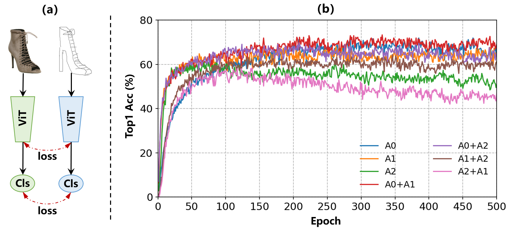
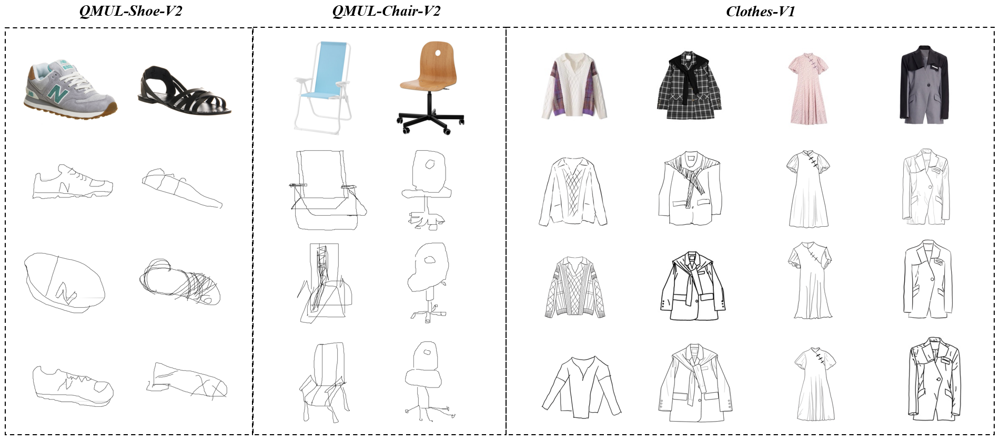
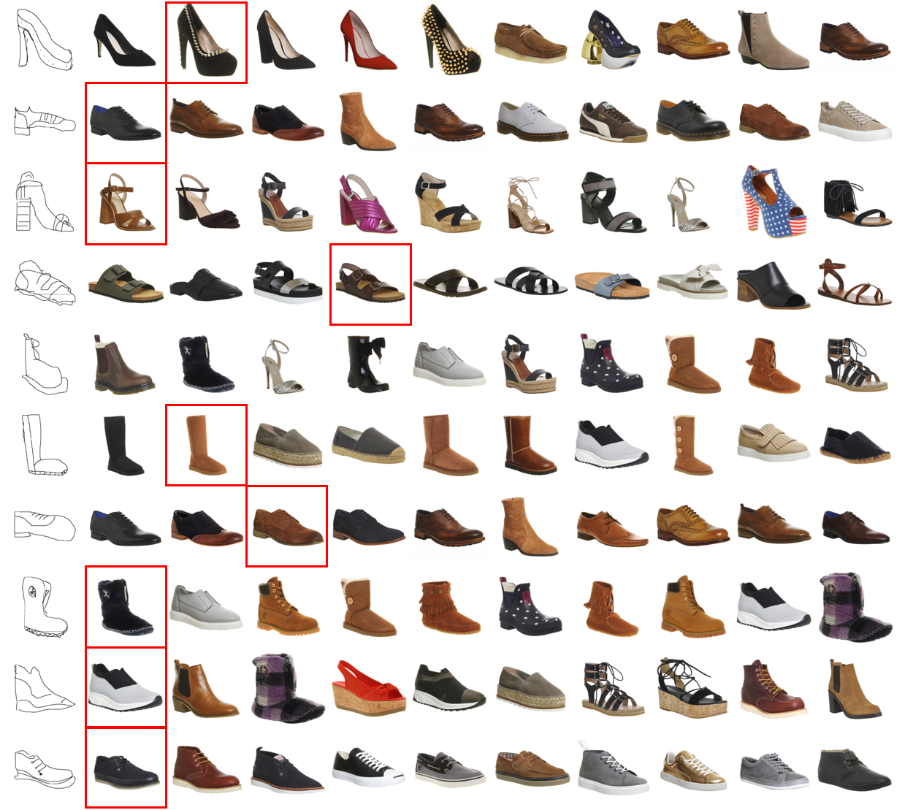
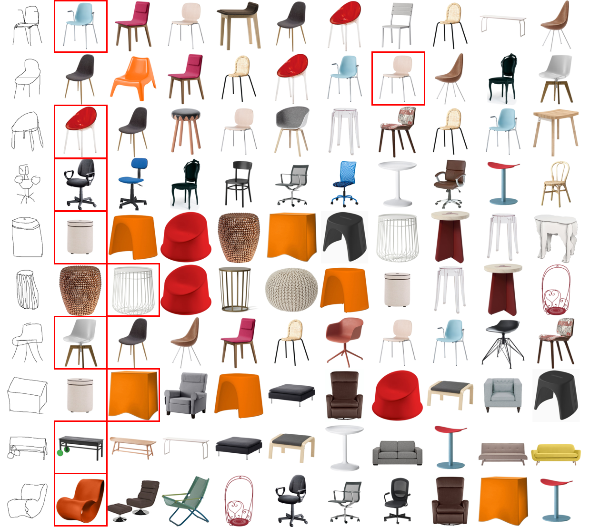
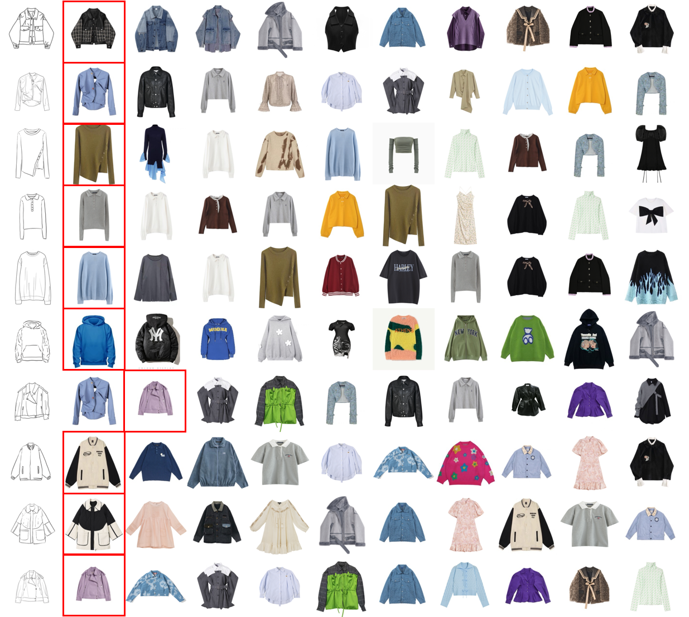
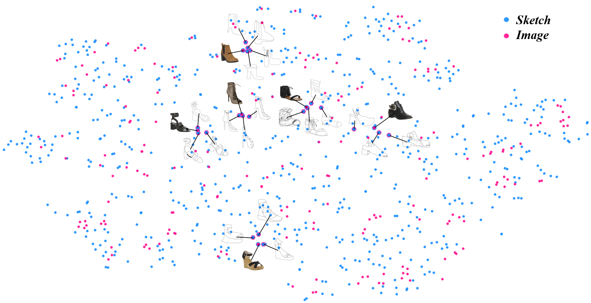
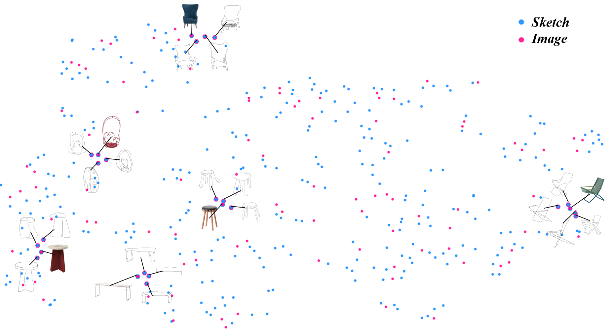
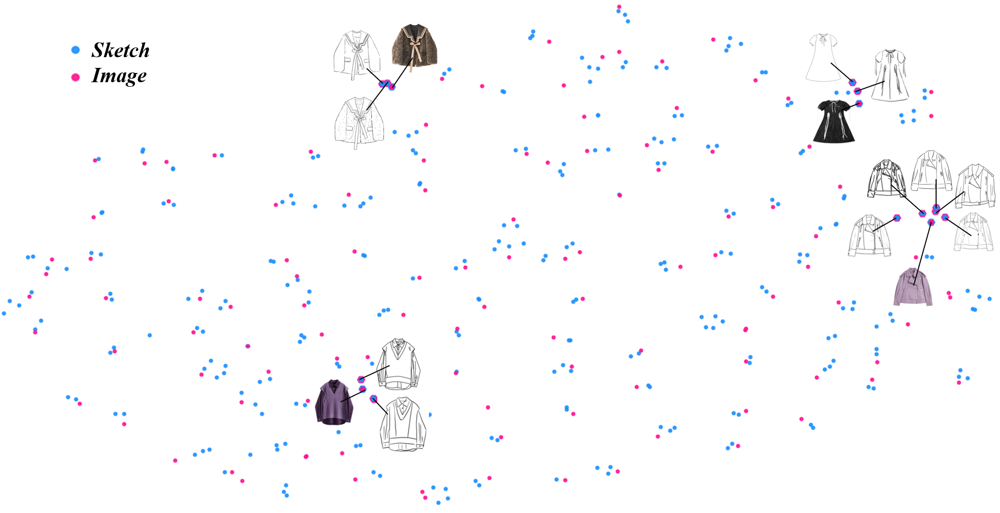
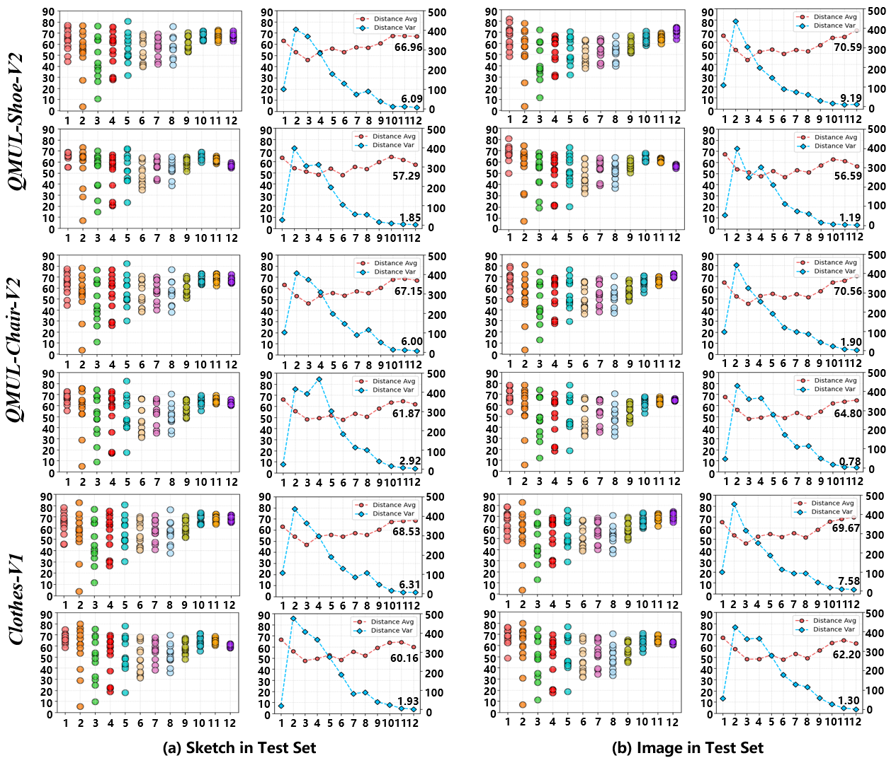

# EffNet
Simple Yet Efficient: Towards Self-Supervised FG-SBIR with Unified Sample Feature Alignment [**[arXiv]**](https://arxiv.org/pdf/2406.11551)

Thank you for your attention, we will update our latest version soon ~

<br>

## 1. Introduction

### 1.1 Framework

#### 1.1.1 How to keep training ? 

<br>

<div align=center></div>

<br>

Our pre-trained model is avialable [**EffNet Weights**](https://drive.google.com/drive/folders/1q9ZBhmFUC4NdkF-uRvgiArvxWUVPSo_x).

### 1.2 Clothes-V1

<div align=center></div>

<br>

The Clothes-V1 is a newly proposed FG-SBIR dataset that aims to facilitate the search for fashion clothing materials by fashion designers. It is also filling the gap in professional fashion clothing datasets in this field. Its multi-level quality can be valuable for other computer vision tasks as well (including FG-SBIR, image generation, image translation, and fashion-related research).

The dataset consists of 1200 sketches and 500 corresponding images, which were split into training and test set with ratios of 925 (380) and 275 (120), respectively.

The sketches were drawn by four professional designers and three junior designers, and the sketches are named using the format **xxxxx_0x.png**, where **xxxxx.png** denotes the corresponding image, and **_0x** denotes the designer (e.g., sketch **00066_01.png** and **00066_06.png** correspond to image **00066.png** and were drawn by designers **01** and **06**, respectively). 

For more details, you can download the [**Clothes-V1**](https://drive.google.com/drive/folders/1630UOV7AFPd2BwjgmZHz8igFAZ68mvnR).

### 1.3 Train model

```bash
./src/datasets/YourDatasetName/
  trainA (sketch simples for training)/
    00001_01.png
    00001_02.png
    00001_03.png
    ...
    00666_01.png
    00666_02.png
    ...
  trainB (image simples for training)/
    00001.png
    ...
    00666.png
    ...
  testA (sketch simples for test)/
    ...
  testB (image simples for test)/
    ...
```

- Download the above data, or you can also customize your own dataset according to the above dataset naming format.
- Put the dataset into (./src/datasets/) directory.
- You can adjust the parameters of the model according to your needs.
- Use the following command for model training :

```
cd ./src

python train_main.py --dataset ClothesV1
```

### 1.4 Evaluate model

- Modify the path of the training model and use the following command :

```
python FG_SBIR.py
```

## 2. Experimental Results

### 2.1 QMUL-Chair-V2 vs. QMUL-Shoe-V2 vs. Clothes-V1

<div align=left>

| Methods | Acc.@1 | Acc.@5 | Acc.@10 | Acc.@1 | Acc.@5 | Acc.@10 | Acc.@1 | Acc.@5 | Acc.@10 |
|:--------:|:--------:|:--------:|:--------:|:--------:|:--------:|:--------:|:--------:|:--------:|:--------:|
| Triplet-SN (CVPR 2016) | 33.75 | 65.94 | 79.26 | 18.62 | 43.09 | 59.31 | 64.36 | 85.82 | 92.73 |
| Triplet-Att-SN (ICCV 2017) | 37.15 | 67.80 | 82.97 | 22.67 | 51.20 | 65.02 | 70.18 | 83.64 | 91.64 |
| B-Siamese (BMVC 2020) | 40.56 | 71.83 | 85.76 | 20.12 | 48.95 | 63.81 | 84.73 | 97.82 | **99.27** | 
| CMHM-SBIR (BMVC 2020) | 51.70 | 80.50 | 88.85 | 29.28 | 59.76 | 74.62 | - | - | - |
| OnTheFly (CVPR 2020) | 39.01 | 75.85 | 87.00 | 35.91 | 66.78 | 78.54 | 63.27 | 90.18 | 92.73 |
| SketchAA (ICCV 2021) | 52.89 | - | 94.88 | 32.22 | - | 79.63 | - | - | - |
| Semi-Sup (CVPR 2021) | 60.20 | 78.10 | 90.81 | 39.10 | 69.90 | **87.50** | - | - | - |
| StyleMeUp (CVPR 2021) | 62.86 | 79.60 | 91.14 | 36.47 | 68.10 | 81.83 | - | - | - |
| Adpt-SBIR (ECCV 2022) | - | - | - | 38.30 | **76.60** | - | - | - | - |
| Part-SBIR (CVPR 2022) | 63.30 | 79.70 | - | 39.90 | 68.20 | 82.90 | - | - | - |
| NT-SBIR (CVPR 2022) | 64.80 | 79.10 | - | 43.70 | 74.90 | - | - | - | - |
| EUPS-SBIR (CVPR 2023) | 71.22 | 80.10 | 92.18 | **44.18** | 70.80 | 84.68 | - | - | - |
| **EffNet(Ours)** | **73.31** | **93.24** | **97.15** | **40.11** | **67.54** | **79.29** | **94.12** | **98.91** | **99.27**  |
| **EffNet+TRSM(Ours)** | **75.45** | **94.66** | **97.87** | **42.91** | **72.95** | **81.72** | **95.27** | **98.55** | **99.27**  |

</div>

## 3. Results Visualization

### 3.1 Retrieval Performance

#### 3.1.1 On QMUL-Shoe-V2

<div align=center></div>

#### 3.1.2 On QMUL-Chair-V2

<div align=center></div>

#### 3.1.3 On Clothes-V1

<div align=center></div>


### 3.2 Feature Embedding (T-SNE)

#### 3.2.1 On QMUL-Shoe-V2

<div align=center></div>

#### 3.2.2 On QMUL-Chair-V2

<div align=center></div>

#### 3.2.3 On Clothes-V1

<div align=center></div>


### 3.3 Average Attention Distance

<div align=center></div>


<br>

## 3. Reference
If you find our code or dataset is useful for your research, please cite us, Thanks.
```yaml
@article{jiang2024simple,
  title={Simple Yet Efficient: Towards Self-Supervised FG-SBIR with Unified Sample Feature Alignment},
  author={Jiang, Jianan and Wu, Di and Jiang, Zhilin and Yu, Weiren},
  journal={arXiv preprint arXiv:2406.11551},
  year={2024}
}
```

Or

```yaml
Jiang J, Wu D, Jiang Z, et al. Simple Yet Efficient: Towards Self-Supervised FG-SBIR with Unified Sample Feature Alignment[J]. arXiv preprint arXiv:2406.11551, 2024.
```

